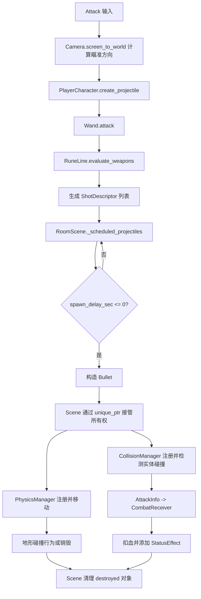
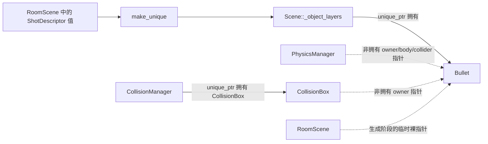
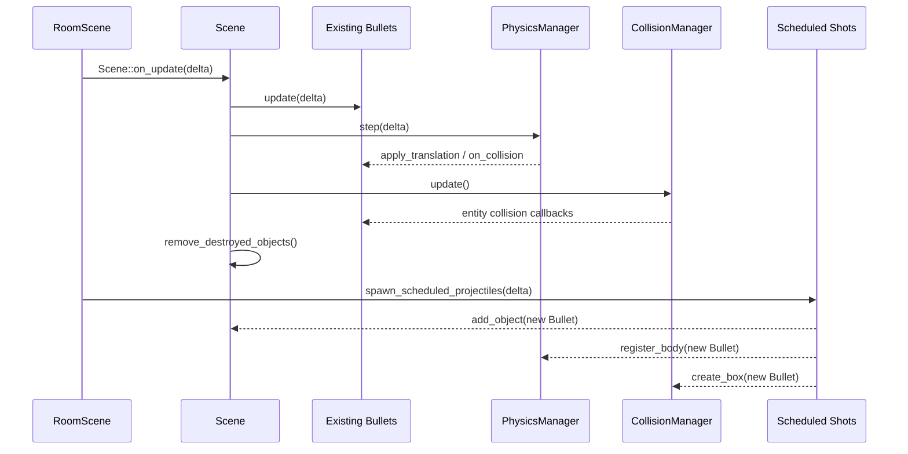

# 当前 Projectile 系统：代码结构与运行流程

本文面向需要维护或扩展 Project Hail Mary 战斗代码的开发者，说明当前已经接入游戏循环的 projectile 实现。

> 当前运行链使用 `ShotDescriptor -> RoomScene -> Bullet`。工作区中的 `projectile_service.h/.cpp` 是尚未接入的开发草稿，不属于本文描述的现有能力。

## 1. 系统总览

当前 projectile 系统并不是一个独立 Manager，而是一条由玩法层和引擎层共同完成的流水线：

1. `RoomScene` 读取 Attack 输入和鼠标位置。
2. `PlayerCharacter` 把发射请求转给自己的 `Wand`。
3. `Wand` 求值 `RuneLine`，生成一个或多个 `ShotDescriptor`。
4. `RoomScene` 保存这些描述，并逐帧递减发射延迟。
5. 描述到期后，`RoomScene` 创建 `Bullet`，交给 `Scene` 持有，并注册物理与实体碰撞。
6. `Bullet` 在每帧更新行为和寿命；`PhysicsManager` 移动它并处理地形碰撞；`CollisionManager` 处理 projectile 与角色的碰撞。
7. 命中后通过 `AttackInfo` 把伤害和状态效果交给 `CombatReceiver`。
8. Bullet 被标记销毁后，`Scene` 注销相关物理/碰撞记录并释放对象。



## 2. 核心类型与职责

| 类型 | 主要职责 | 是否拥有活动 Bullet |
| --- | --- | --- |
| [`Projectile`](../gameplay/combat/projectile.h) | 提供速度、运动接口、碰撞矩形和通用销毁入口 | 否 |
| [`Bullet`](../gameplay/combat/bullet.h) | 实现渲染、伤害、寿命、命中冷却、行为与音效 | 否 |
| [`Wand`](../gameplay/combat/wand.h) | 把 Rune 配置转换为一次攻击的发射描述 | 否 |
| `ShotDescriptor` | 保存一颗“未来子弹”的属性、方向、相对偏移和延迟 | 否，它不是场景对象 |
| [`RoomScene`](../gameplay/scene/room_scene.h) | 接收输入、调度描述、创建并注册 Bullet | 只拥有调度队列 |
| `Scene` | 按深度层保存 `unique_ptr<GameObject>`，更新和最终释放对象 | 是 |
| `PhysicsManager` | 根据速度移动 KinematicBody，并处理 tile/world 碰撞 | 否 |
| `CollisionManager` | 持有 `CollisionBox`，检测对象间 AABB 碰撞并调用回调 | 只拥有 CollisionBox |

这套设计中最重要的区别是：`ShotDescriptor` 表示“发射意图”，`Bullet` 才是已经进入世界的运行时对象。

## 3. 从输入到发射描述

### 3.1 输入与世界坐标

[`RoomScene::on_input()`](../gameplay/scene/room_scene.cpp) 先让基类 `Scene` 把输入快照分发给场景对象，然后处理场景自己的 Attack 操作。

当 Attack 在本帧刚被按下时：

- 默认方向是 `(1, 0)`。
- 如果输入快照包含指针坐标，则调用 `camera.screen_to_world()` 把窗口坐标转换成世界坐标。
- 用“鼠标世界坐标 - 玩家中心”得到瞄准向量。
- 零向量回退到向右，其他情况归一化。

随后调用：

```cpp
std::vector<ShotDescriptor> shots =
    _player->create_projectile(shot_direction);
```

`PlayerCharacter::create_projectile()` 自身不创建对象，只转调 `_wand.attack(direction)`。

### 3.2 RuneLine 求值

[`RuneLine`](../gameplay/combat/grid/rune_line.h) 是一条可扩展的 Rune 槽位数组。当前存在三类 Rune：

- `Weapon`：提供一组基础 `WandAttributes`、`Bullet_Attributes` 和可选行为。
- `Stat`：修改已经建立的 loadout，例如伤害、子弹数量和散射模式。
- `Behavior`：向 loadout 添加一个“行为构造回调”。

`evaluate_weapons()` 从左到右寻找 Weapon Rune，并为每个 Weapon 构建 `RuneWeaponNode`。Weapon 可以消费后续槽位：

- `AddModifiers`：把子 Weapon 的部分属性和行为合并进父 loadout，不产生额外分支。
- `FireNested`：保留为子节点，之后由 `Wand` 递归产生额外射击。

一个 `RuneLoadout` 的核心结果可以简化为：

```text
RuneLoadout
  = WandAttributes
  + Bullet_Attributes
  + vector<behavior appender>
```

Behavior Rune 不直接创建一个共享的 `BulletBehavior`。它保存的是类似下面的回调：

```cpp
[bounces](BulletBehaviorSet& set)
{
    set.add(std::make_unique<BounceBehavior>(bounces));
}
```

因此每颗 Bullet 都会得到独立的行为对象；反弹次数、穿透次数、贴墙计时等运行状态不会被其他 Bullet 共享。

### 3.3 Wand 生成 ShotDescriptor

[`Wand::attack()`](../gameplay/combat/wand.cpp) 对 `RuneLine::evaluate_weapons()` 的结果逐个调用 `append_weapon_shots()`。每个 Weapon 节点根据 `bullet_count` 生成若干描述，嵌套 Weapon 则递归追加描述。

`make_shot()` 的主要计算为：

```text
aim             = normalize(input direction)
angle           = spread calculation(index)
shot_direction  = rotate(aim, angle)
bullet_velocity = shot_direction * bullet_speed
spawn_offset    = shot_direction * spawn_distance
spawn_delay     = parent delay + weapon shot delay
```

散射方式由 `SpreadStyle` 决定：

- `Uniform`：在 `[-spread/2, +spread/2]` 间等距分布；单发时角度为 0。
- `Circular`：以 `360 / bullet_count` 的间隔环形分布。
- `Random`：使用 `std::rand()` 在散射范围内取随机角度。

发射时序由 `ShotStyle` 决定：

- `Simultaneous`：同一个 Weapon 的各发延迟相同。
- `Sequential`：按 index 递增 `shot_delay_sec`。
- `ReverseSequential`：按反向 index 计算延迟。

每颗描述还会保存本次求值后的 `Bullet_Attributes`，包括速度、尺寸、伤害、最大寿命、状态效果、音效 key 和行为构造回调。后续修改 Wand 不会反向改变已经排队的描述。

### 3.4 ShotDescriptor 不是 Projectile

[`ShotDescriptor`](../gameplay/combat/wand_types.h) 只包含值数据：

```text
Bullet_Attributes bullet_attributes
Vector2           spawn_offset
Vector2           shot_direction
float             spawn_delay_sec
```

它没有 `GameObject` 生命周期、纹理、碰撞盒或物理注册。这样 `Wand` 只负责描述“要发射什么”，而不需要知道当前 Scene、PhysicsManager 或 CollisionManager。

## 4. 延迟调度与 Bullet 创建

### 4.1 RoomScene 调度队列

Attack 产生的描述会追加到 `RoomScene::_scheduled_projectiles`。每帧 `spawn_scheduled_projectiles(delta)`：

1. 对每个描述执行 `spawn_delay_sec -= delta`。
2. 延迟仍大于 0 的描述留在队列中。
3. 到期描述使用“玩家当前中心 + spawn_offset”计算出生位置。
4. 构造 `std::unique_ptr<Bullet>`。
5. 调用 `Scene::add_object()` 把对象交给 Scene。
6. 从调度队列删除该描述。
7. 注册物理 body 和实体碰撞盒。

出生位置在实际生成时才解析，而不是在按下 Attack 时固定。因此延迟射击会跟随玩家移动后的当前位置，但发射方向和速度仍是最初生成 `ShotDescriptor` 时计算的值。

### 4.2 所有权转移



`Scene::add_object()` 返回刚加入对象的裸指针，同时把 `unique_ptr` 放入对应 `DepthLayer`。它还会根据动态类型把对象注册进 `_updatables` 等接口列表。此后真正的对象所有者是 Scene，其他系统不能释放这个指针。

### 4.3 物理与实体碰撞注册

创建成功后，RoomScene 使用同一个 `Projectile*` 作为：

- PhysicsManager 的 owner；
- `KinematicBody`，提供 `desired_velocity()` 和 `apply_translation()`；
- `Collidable`，提供 tile collision rect 和 `on_collision()`。

实体碰撞盒配置为：

```text
layer   = PlayerProjectile
targets = Enemy
```

Enemy 的 hurt box 则是：

```text
layer   = Enemy
targets = PlayerProjectile
```

`CollisionBox::can_collide_with()` 要求双方的 target mask 都接受对方 layer，因此只有双向配置匹配时才会触发回调。

## 5. Projectile 基类

[`Projectile`](../gameplay/combat/projectile.h) 同时实现四种角色：

- `GameObject`：位置、尺寸、深度层、激活/销毁状态。
- `Updatable`：允许 Scene 在每帧调用 `update()`。
- `KinematicBody`：向 PhysicsManager 暴露期望速度与平移入口。
- `Collidable`：向 PhysicsManager 暴露地形碰撞矩形与碰撞回调。

它维护三组关键状态：

- `_velocity`：PhysicsManager 每帧读取的期望速度。
- `_collision_rect`：用于 tile/world 运动约束。
- `_damage_rect`：同步给 CollisionBox，用于对象间命中检测。

位置或尺寸改变时，Projectile 会同步这些矩形，并更新它保存的非拥有 `CollisionBox*`。`apply_translation()` 同样移动世界位置、两个矩形和 collision box。

默认地形碰撞和实体碰撞都会调用 `destroy()`。派生类可以覆盖回调；`Bullet` 就把最终是否销毁交给 BehaviorSet 判断。

## 6. Bullet 运行时实现

### 6.1 构造

[`Bullet::Bullet()`](../gameplay/combat/bullet.cpp) 完成以下工作：

1. 用 `start_position`、`bullet_size` 和 `bullet_velocity` 初始化 Projectile。
2. 从 ResourceManager 查找固定 key `"bullet"` 的纹理。
3. 拷贝本次射击的 `Bullet_Attributes`。
4. 执行每个 behavior appender，建立本 Bullet 独享的 `BulletBehaviorSet`。
5. 保存初始伤害，并触发所有行为的 `on_fire()`。
6. 配置 Wand 音效组，播放发射音效，并按需启动循环飞行音效。

### 6.2 每帧更新

`Bullet::update(delta)` 的顺序是：

1. 增加 projectile age。
2. 递减 `_hit_cooldowns` 中的实体命中冷却并删除到期项。
3. 超过 `max_age` 时标记销毁。
4. 调用 BehaviorSet 的 `on_update()`。

PhysicsManager 不在 `Bullet::update()` 内移动对象。Scene 在完成所有 Updatable 更新后，统一调用 `PhysicsManager::step(delta)`，再调用 `CollisionManager::update()`。

### 6.3 渲染

Bullet 使用 `world_rect()` 构造 RenderCommand。只要速度非零，就通过 `atan2(y, x)` 计算旋转角，使固定的 `"bullet"` 纹理朝向飞行方向。Scene 随后把世界矩形转换为屏幕矩形并执行渲染。

### 6.4 伤害和状态效果

`Bullet::attack_info()` 从当前属性生成：

- `base_damage`；
- 可选的一个 `StatusEffect` 实例。

CollisionManager 检测到 PlayerProjectile 与 Enemy 相交后，RoomScene 注册的回调会：

1. 把对方 owner 转换为 `CombatReceiver`。
2. 调用 `Bullet::can_hit()` 检查该对象是否还在命中冷却中。
3. 调用 `receive_attack(attack_info)`。
4. 调用 `Bullet::on_entity_collision()`。

`Character::receive_attack()` 扣除基础伤害，并把状态效果交给自身的 `StatusEffectManager`。Bullet 同时把该实体加入 `_hit_cooldowns`，避免穿透型 projectile 每一帧都重复伤害同一个目标。

### 6.5 音效生命周期

`Bullet_Attributes` 支持五个事件音效 key：

- `sound_on_fire`
- `sound_on_collision`
- `sound_on_entity_collision`
- `sound_on_death`
- `sound_during_flight`

空 key 表示不播放。飞行音效使用循环播放，并保存返回的 `SoundHandle`；`on_destroy()` 会播放死亡音效、停止飞行音效并清空 handle。

## 7. Bullet Behavior 系统

[`BulletBehavior`](../gameplay/combat/bullet_behavior/bullet_behavior.h) 定义五个扩展点：

```text
on_fire
on_update
on_collision          -> bool
on_entity_collision   -> bool
on_death
```

`BulletBehaviorContext` 始终包含 Bullet 引用，并按事件附带 `entity`、`collision_direction` 或 `delta`。

| Behavior | 参数/状态 | 触发阶段 | 当前行为 |
| --- | --- | --- | --- |
| `AccelerationBehavior` | acceleration | `on_update` | 沿当前速度方向增加速度 |
| `DecelerationBehavior` | deceleration、min speed | `on_update` | 降低速度但不低于最小值 |
| `CurveBehavior` | curve | `on_update` | 沿飞行方向的局部左向量施加转向量 |
| `GrowthBehavior` | growth、首次记录的 base damage | `on_update` | 按 `base + growth * age` 增加伤害 |
| `HomingBehavior` | strength、maintains speed | `on_update` | 查询 RoomScene 最近敌人，限制转向量后修正速度 |
| `BounceBehavior` | remaining bounces | `on_collision` | 反射发生碰撞的速度轴，播放 bounce 音效并消耗次数 |
| `PierceBehavior` | remaining pierces | `on_entity_collision` | 消耗穿透次数并播放 pierce 音效，使 Bullet 不因本次实体碰撞销毁 |
| `WallStickBehavior` | stick length、activation interval | `on_collision` 与 `on_update` | 暂停在墙边，按间隔重放其他地形碰撞行为，时间结束后恢复速度 |

### 7.1 地形碰撞返回值

`BulletBehaviorSet::on_collision()` 按保存顺序调用行为：

- 某个行为返回 `true`：认为碰撞已处理，立即停止后续行为，并保留 Bullet。
- 所有行为都返回 `false`：调用 `Bullet::destroy()`。

因此地形碰撞的行为顺序会影响结果。例如 Bounce 在还有次数时返回 `true`，排在它后面的碰撞行为不会在该次普通分发中执行。

WallStick 的周期触发走 `replay_collision_behaviors_except()`：跳过 WallStick 自身，但调用其他地形碰撞行为，而且忽略它们的返回值。这与普通 `on_collision()` 的短路语义不同。

### 7.2 实体碰撞返回值

`BulletBehaviorSet::on_entity_collision()` 会调用全部行为，不会在第一个 `true` 处停止：

- 至少一个行为返回 `true`：保留 Bullet。
- 所有行为都返回 `false`：销毁 Bullet。

当前只有 Pierce 使用这一语义来让 Bullet 穿过实体。即使某个行为已经处理碰撞，其他实体碰撞行为仍会收到同一次事件。

## 8. 每帧执行顺序

[`RoomScene::on_update()`](../gameplay/scene/room_scene.cpp) 的调用顺序非常重要：



由此产生一个明确结果：本帧末尾刚生成的 Bullet 已经属于 Scene，但不会在同一帧再次进入 `Bullet::update()`、PhysicsManager 或 CollisionManager；它从下一帧开始运动和碰撞。

暂停时，Scene 不执行物理与碰撞更新。对象 update 是否继续则取决于该对象的 `update_when_paused()` 设置。

## 9. 销毁与场景清理

`destroy()` 只把 SceneObject 标记为 destroyed，不立即释放内存。Scene 在更新末尾执行 `remove_destroyed_objects()`：

1. 从 Updatable 和输入接收器列表移除 destroyed 对象。
2. 从 PhysicsManager 注销 owner 对应的 body。
3. 从 CollisionManager 注销 owner 对应的所有 CollisionBox。
4. 从 Scene 的 `unique_ptr` 容器删除对象并释放内存。

CollisionManager 在执行一侧碰撞回调后，会重新检查双方 owner 是否仍有效，再决定是否调用另一侧回调。这避免第一侧回调销毁对象后继续对无效对象分发。

`RoomScene::on_exit()` 和 `reset()` 都会：

- 销毁所有 Scene 对象；
- 清空 enemy 跟踪列表；
- 清空 `_scheduled_projectiles`；
- 清除 collision world 和场景裸指针。

因此未到期的延迟射击不会跨场景退出或 reset 保留下来。

## 10. 如何扩展当前系统

### 10.1 增加 Bullet 属性

1. 在 `Bullet_Attributes` 增加值字段并给出安全默认值。
2. 在 Weapon/Stat Rune 中产生或修改该字段。
3. 在 `Bullet` 构造、更新、渲染或攻击信息中消费它。
4. 确认 `ShotDescriptor` 的值拷贝仍符合预期，尤其注意智能指针和回调的共享语义。

### 10.2 增加 Bullet Behavior

1. 从 `BulletBehavior` 派生新类并选择正确事件钩子。
2. 明确碰撞钩子的 `bool` 是否表示“本次碰撞已处理”。
3. 新建对应 Behavior Rune，让它把构造回调追加到 loadout。
4. 验证多个行为组合时的执行顺序、短路和独立状态。

### 10.3 增加 Weapon 或 Stat Rune

- Weapon Rune 设置完整的基础 Wand/Bullet 属性和 consumption 策略。
- Stat Rune 只修改已经建立的 loadout。
- 若支持嵌套 Weapon，要验证 `consumed_runes`、父子延迟和递归产生的总 Shot 数。

### 10.4 增加新的 Projectile 类型

当前 RoomScene 直接 `make_unique<Bullet>()`，所以新增类型不能只继承 `Projectile` 就自动出现。至少需要：

1. 定义派生类的渲染、攻击和命中规则。
2. 给发射描述增加可区分类型或创建策略。
3. 在生成位置选择正确的具体类型。
4. 为该类型配置 PhysicsManager、CollisionLayer、CollisionTarget 和回调。

这也是当前实现最明显的扩展边界之一。

## 11. 当前限制与注意事项

- **生成逻辑绑定 RoomScene**：延迟队列、具体 `Bullet` 构造、碰撞层和伤害回调都写在 RoomScene 中，其他 Scene 不能直接复用。
- **只支持玩家 Bullet 到 Enemy**：生成代码固定使用 `PlayerProjectile -> Enemy`；虽然枚举存在 `EnemyProjectile`，当前流程没有通用化发射阵营。
- **Homing 直接查 RoomScene**：行为通过 `SceneManager::try_find_scene<RoomScene>()` 获取最近敌人，不是可注入的目标查询接口。
- **敌人列表是非拥有裸指针**：`closest_enemy_to_point()` 依赖 `_enemies` 的维护；查询本身没有过滤 destroyed/dead enemy。
- **调度依赖玩家裸指针**：到期时使用 `_player->center()` 解析出生位置，调度函数本身没有再次验证玩家指针。
- **随机数不可复现**：散射和状态效果使用 `std::rand()`/`rand()`，没有命名 RNG 流或显式 seed 依赖。
- **纹理 key 固定**：所有 Bullet 都查找 `"bullet"`，属性和 Weapon Rune 不能选择不同 projectile 外观。
- **Scene 加入与系统注册不是事务**：Bullet 加入 Scene 后再分别注册 physics 和 collision；当前代码只显式处理 `add_object()` 失败。
- **行为可以修改 Bullet_Attributes**：Growth 通过临时暴露的 `get_bullet_attributes()` 修改伤害，说明 Behavior API 尚未完全封装。
- **碰撞行为顺序敏感**：地形碰撞会在第一个 `true` 处短路，Rune 排列改变可能改变组合效果。
- **测试配置硬编码**：`Wand::seed_test_runes()` 当前直接放入 Fireball 与 WallStick Rune，尚未由正式数据或玩家装备系统驱动。
- **冷却键是裸对象指针**：Bullet 用 `GameObject*` 作为命中冷却表 key；生命周期安全依赖 Scene/碰撞调用顺序。

## 12. 快速定位索引

- 输入、调度、生成和碰撞回调：[`gameplay/scene/room_scene.cpp`](../gameplay/scene/room_scene.cpp)
- 玩家到 Wand 的入口：[`gameplay/characters/player_character.cpp`](../gameplay/characters/player_character.cpp)
- Wand 射击计算：[`gameplay/combat/wand.cpp`](../gameplay/combat/wand.cpp)
- 发射数据结构：[`gameplay/combat/wand_types.h`](../gameplay/combat/wand_types.h)
- Rune 求值：[`gameplay/combat/grid/rune_line.cpp`](../gameplay/combat/grid/rune_line.cpp)
- Projectile 基类：[`gameplay/combat/projectile.h`](../gameplay/combat/projectile.h)
- Bullet 实现：[`gameplay/combat/bullet.cpp`](../gameplay/combat/bullet.cpp)
- Behavior 分发：[`gameplay/combat/bullet_behavior/bullet_behavior_set.cpp`](../gameplay/combat/bullet_behavior/bullet_behavior_set.cpp)
- 内置 Behavior：[`gameplay/combat/bullet_behavior/behavior_list.cpp`](../gameplay/combat/bullet_behavior/behavior_list.cpp)
- 物理移动：[`engine/physics/physics_manager.cpp`](../engine/physics/physics_manager.cpp)
- 对象间碰撞：[`engine/physics/collision_manager.cpp`](../engine/physics/collision_manager.cpp)
- Scene 所有权与清理：[`engine/scene/scene.cpp`](../engine/scene/scene.cpp)
